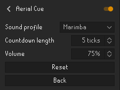

# Aerial Cue

Audio cues that teach you the rhythm of aerial fishing.

<!-- TODO: screenshot / gif goes here -->
<!--  -->

## What it does

While participating in Aerial Fishing, the plugin plays a short countdown of rising notes while your bird is out. 
The last note lands on the tick the next fishing spot becomes clickable, so you click on the note rather than reacting
after it.

Because the cues are pitched, each length of wait has its own shape. You stop counting notes
and start recognizing the musical phrase. You learn to click on sound on the exact tick 
the cormorant returns. The audio cues run together into a beat you fish to.

## Settings

**Sound profile** — which set of sounds to count down with. Several are bundled, from clean
tones to marimba, kalimba, plucked string, guitar chords and deep percussion. They all play
the same rising pattern, so switching profiles changes the character without changing the music to muscle memory
you have developed.

**Countdown length** — how many notes to play, 1 to 5. Lower it if the full run feels busy.
At 1 you get a single note, exactly when you can click.

**Volume** — how loud the cues are, on top of your normal RuneLite volume.

